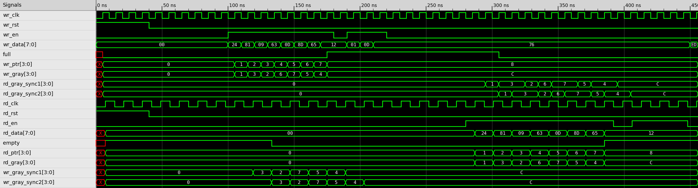

# Asynchronous FIFO Verilog RTL

An 8-bit asynchronous FIFO with an 8-entry depth, designed for transferring data between two independent clock domains.

## Overview

This project implements an asynchronous FIFO using separate write and read clock domains.

The FIFO allows data to be written using `wr_clk` and read using `rd_clk`, where the two clocks are independent and have different frequencies.

The design includes:

- 8-bit data width
- 8-entry FIFO depth
- Independent write and read clock domains
- Binary write and read pointers
- Gray-code pointer conversion
- Two-stage clock-domain synchronization
- Full and empty detection
- Registered read data
- Scoreboard-based simulation verification

## Architecture

```text
              WRITE CLOCK DOMAIN
                    wr_clk
                      |
                      v
               +-------------+
               | Write Logic |
               +-------------+
                      |
                Binary Pointer
                      |
                  Gray Code
                      |
                      v
               +-------------+
               | 2-FF Sync   |------------------+
               +-------------+                   |
                                                 v
                                          READ CLOCK DOMAIN
                                                rd_clk
                                                  |
                                                  v
                                           +-------------+
                                           |  Read Logic |
                                           +-------------+
                                                  |
                                            Binary Pointer
                                                  |
                                              Gray Code
                                                  |
                                                  v
                                           +-------------+
                                           | 2-FF Sync   |------------------+
                                           +-------------+                   |
                                                                             |
                         +---------------------------+                       |
                         |       FIFO Memory         |<----------------------+
                         |         8 x 8 bits        |
                         +---------------------------+
```

The write pointer is synchronized into the read clock domain, while the read pointer is synchronized into the write clock domain.

## FIFO Operation

### Write Side

A write is accepted only when:

```text
wr_en = 1
full  = 0
```

The input data is stored in the FIFO memory at the current write address.

The write pointer is then incremented and converted to Gray code.

### Read Side

A read is accepted only when:

```text
rd_en = 1
empty = 0
```

The data at the current read address is transferred to `rd_data`.

The read pointer is then incremented and converted to Gray code.

## Clock-Domain Crossing

The write and read clocks are independent, so the binary pointers are not directly transferred between clock domains.

Instead:

1. The local binary pointer is converted to Gray code.
2. The Gray-coded pointer is passed to the other clock domain.
3. A two-stage synchronizer is used to reduce metastability risk.
4. The synchronized pointer is used for full/empty detection.

Gray code is used because only one bit changes between consecutive pointer values. This makes pointer transitions safer to synchronize across clock domains.

## FIFO Full and Empty Detection

The FIFO is empty when the read pointer matches the synchronized write pointer:

```verilog
assign empty = (rd_gray == wr_gray_sync2);
```

The FIFO is full when the write Gray pointer reaches the wrapped position corresponding to the synchronized read pointer:

```verilog
assign full = (wr_gray == {~rd_gray_sync2[3:2], rd_gray_sync2[1:0]});
```

The pointers use an additional bit beyond the 3-bit memory address. This extra bit tracks pointer wraparound and allows the design to distinguish between an empty FIFO and a full FIFO.

## Verification

The testbench uses two unrelated clocks:

- Write clock: 100 MHz
- Read clock: approximately 71 MHz

The verification covers:

- Reset behavior
- Filling the FIFO with 8 consecutive writes
- Full-condition checking
- Overflow attempts
- Reading all stored data
- Empty-condition checking
- Underflow attempts
- Random simultaneous read/write activity
- Final FIFO drain
- Data-order verification

A scoreboard records every accepted write and compares each accepted read with the expected data.

## Simulation

The design can be simulated using Icarus Verilog.

### Compile

```bash
iverilog -o async_fifo_sim async_fifo.v async_fifo_tb.v
```

### Run

```bash
vvp async_fifo_sim
```

The testbench generates:

```text
async_fifo.vcd
```

### View Waveform

```bash
gtkwave async_fifo.vcd
```

The waveform shows the independent clocks, reset signals, read/write enables, FIFO data, pointer movement, Gray-code synchronization, and full/empty status.



## Files

| File | Description |
|------|-------------|
| `async_fifo.v` | Asynchronous FIFO RTL |
| `async_fifo_tb.v` | Verification testbench |
| `async_fifo_vcd_waveform.png` | Simulation waveform |
| `README.md` | Project documentation |

## Tools

- Verilog HDL
- Icarus Verilog
- GTKWave

## Key Concepts

- Asynchronous FIFO
- Clock-domain crossing (CDC)
- Gray-code pointers
- Two-flop synchronization
- FIFO full/empty detection
- Dual-clock operation
- FIFO memory management
- Scoreboard-based verification
- RTL simulation
